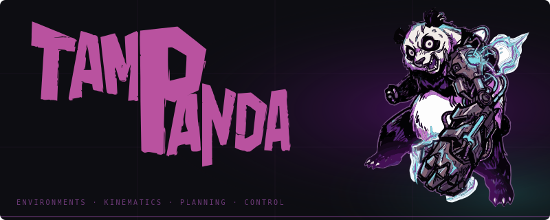

[](LICENSE)
[](pyproject.toml)
[](https://mujoco.org)

**TAMPanda** is a task and motion planning library for the Franka Emika Panda robot, built on [MuJoCo](https://github.com/google-deepmind/mujoco) and [MINK](https://github.com/kevinzakka/mink). It combines continuous motion planning (RRT*, IK) with discrete symbolic planning (PDDL) and supports dataset generation for learning-based methods.

## Features

- **Environment Simulation**: MuJoCo-based robot environments with collision detection
- **Inverse Kinematics**: Fast IK solving using MINK
- **Motion Planning**: RRT* with path smoothing
- **Robot Control**: Position-based controller with gravity-compensated trajectory following
- **Grasp Planning**: Geometry-aware `GraspPlanner` with ranked candidates (top-down, front approach), table-clearance and gripper-width checks
- **Pick and Place**: Reusable `PickPlaceExecutor` with multi-candidate retry and kinematic object attachment
- **Franka Panda Support**: Pre-configured support for Franka Emika Panda robot
- **Symbolic Planning**: Grid-based and blocks-world PDDL domains; `ActionFeasibilityChecker` for validating pick/drop with IK + RRT*
- **Dataset Generation**: Multiprocessing-capable data generation with BFS planning, feasibility validation, and optional W&B logging
- **Camera Support**: RGB, depth, segmentation, and pointcloud rendering via `MujocoCamera`
- **Programmatic Scene Builder**: `SceneBuilder` assembles MJCF scenes from reusable object templates at runtime — no static XML editing. Supports per-instance position, rotation, and colour overrides; hot-reload with physics state preservation.
- **Remote Asset Library**: `YCBDownloader` and `GSODownloader` fetch YCB objects (`elpis-lab/ycb_dataset`) and Google Scanned Objects (`kevinzakka/mujoco_scanned_objects`) from GitHub on demand, caching them under `~/.cache/tampanda/assets/`. Full-MJCF assets (meshes, materials) are namespace-merged into scenes automatically.

## Installation

```bash
pip install -e .
```

Dependencies: `mujoco>=3.0.0`, `mink>=0.0.1`, `numpy`, `loop-rate-limiters`, `matplotlib`, `opencv-python`

## Quick Start

### Build a scene programmatically

```python
from tampanda import SceneBuilder
from tampanda.scenes import CYLINDER_THIN_TEMPLATE, TABLE_SYMBOLIC_TEMPLATE

builder = SceneBuilder()
builder.add_resource("table",    TABLE_SYMBOLIC_TEMPLATE)
builder.add_resource("cylinder", CYLINDER_THIN_TEMPLATE)
builder.add_object("table",    pos=[0.45, 0.0, 0.0])
builder.add_object("cylinder", pos=[0.45, 0.0, 0.36], rgba=[1.0, 0.2, 0.2, 1.0])
env = builder.build_env(rate=200.0)
```

### Pick and place (blocks domain)

```python
from tampanda import RRTStar, GraspPlanner, PickPlaceExecutor
from tampanda.symbolic.domains.blocks import make_blocks_builder

env      = make_blocks_builder().build_env(rate=200.0)
planner  = RRTStar(env)
executor = PickPlaceExecutor(env, planner, GraspPlanner(table_z=0.27))

executor.pick("block_0", env.get_object_position("block_0"),
              env.get_object_half_size("block_0"),
              env.get_object_orientation("block_0"))
executor.place("block_0", place_center)
```

### Tabletop PDDL feasibility checking (headless)

```python
from tampanda import RRTStar
from tampanda.symbolic import GridDomain, StateManager
from tampanda.symbolic.domains.tabletop import make_symbolic_builder
from tampanda.symbolic.domains.tabletop.feasibility import ActionFeasibilityChecker
from tampanda.planners.grasp_planner import GraspPlanner

env     = make_symbolic_builder().build_env(rate=200.0)
planner = RRTStar(env)
grid    = GridDomain(env.model, cell_size=0.04, working_area=(0.4, 0.3),
                     table_geom_name="simple_table_surface",
                     grid_offset_x=0.05, grid_offset_y=0.25)
checker = ActionFeasibilityChecker(env, planner, StateManager(grid, env),
                                   GraspPlanner(table_z=grid.table_height))
feasible, _ = checker.check("pick", state, cylinder_name="cylinder_0")
```

## Remote Assets (YCB & Google Scanned Objects)

The library can download objects from two external repositories and cache them locally:

| Source | Repo | Objects |
|--------|------|---------|
| YCB | `elpis-lab/ycb_dataset` | ~80 YCB household objects (MJCF) |
| GSO | `kevinzakka/mujoco_scanned_objects` | ~1 030 Google Scanned Objects (CoACD hulls) |

Objects are cached under `~/.cache/tampanda/assets/` (override with `TAMPANDA_ASSETS_CACHE`).
Set `GITHUB_TOKEN` in your environment to raise the GitHub API rate limit from 60 to 5 000 requests/hour.

```python
from tampanda.scenes import SceneBuilder, YCBDownloader, GSODownloader

# Programmatic download + placement
builder = SceneBuilder()
builder.add_resource("table",   {"type": "builtin", "name": "objects/table_symbolic.xml"})
builder.add_resource("can",     {"type": "ycb",  "name": "002_master_chef_can"})
builder.add_resource("clock",   {"type": "gso",  "name": "Alarm_Clock"})
builder.add_object("table",  pos=[0.45, 0.0,  0.00])
builder.add_object("can",    pos=[0.40, 0.0,  0.33])
builder.add_object("clock",  pos=[0.50, 0.1,  0.33])
env = builder.build_env(rate=200.0)

# List what's available
print(YCBDownloader().list_available())
print(GSODownloader().list_available()[:10])
```

Downloaded assets are full MJCF documents — meshes, materials, and textures are automatically
namespaced and path-rewritten before being merged into the scene, so multiple copies of the
same object can coexist without name collisions.

## Examples

```bash
cd examples

# Basic control
python basic_ik.py            # IK control
python basic_rrt.py           # RRT* motion planning

# Grasping with hardcoded poses
python grasping_ik.py         # Pick and place with IK
python grasping_rrt.py        # Pick and place with RRT*
python grasping_rrt_camera.py # RRT* grasping + camera capture (headless)

# Grasping with GraspPlanner (geometry-aware)
python grasping_ik_planner.py
python grasping_rrt_planner.py

# Blocks world
python blocks_world_rrt.py    # Pick two cubes onto a platform using PickPlaceExecutor
python blocks_world_demo.py   # Symbolic state grounding + PDDL generation
mjpython blocks_scene.py      # Blocks domain visual verification (SceneBuilder)

# Symbolic / tabletop
mjpython symbolic.py               # Grid-based PDDL planning
python symbolic_grasping_rrt.py    # Symbolic plan executed with RRT*
python demo_solve.py               # Headless BFS planning → full physical execution in viewer
mjpython scene_builder.py          # Programmatic scene construction + hot-reload demo

# Remote assets (YCB + Google Scanned Objects)
mjpython object_browser.py                         # Interactive: browse, download, view objects
mjpython object_browser.py --ycb 002_master_chef_can 003_cracker_box
mjpython object_browser.py --gso Alarm_Clock Apple
python  object_browser.py  --list-ycb              # Print all available YCB names (headless)
python  object_browser.py  --list-gso              # Print all available GSO names (headless)

# Benchmarks (all headless, fast)
python benchmark_grasping.py              # GraspPlanner + RRT* on blocks
python benchmark_cylinder_grasping.py     # Direct IK vs RRT* on cylinders
python benchmark_feasibility.py           # ActionFeasibilityChecker correctness
python benchmark_feasibility_params.py    # RRT/IK parameter sweep (finds fastest zero-FN combo)
```

## Data Generation

Generate PDDL problems with motion-planning-validated feasibility labels:

```bash
python -m tampanda.symbolic.domains.tabletop.generate_data \
    --num-train 200 --num-val 20 --num-test 20 \
    --output-dir data/tabletop \
    --num-workers 0          # 0 = all available CPUs
```

Key flags:

| Flag | Default | Notes |
|------|---------|-------|
| `--num-workers` | 1 | 0 = all CPUs |
| `--grid-offset-x` | 0.05 | calibrated reachable zone |
| `--grid-offset-y` | 0.25 | calibrated reachable zone |
| `--rrt-iters` | 1000 | benchmarked fastest zero-false-negative |
| `--ik-iters` | 100 | benchmarked fastest zero-false-negative |
| `--ik-pos-thresh` | 0.005 | benchmarked fastest zero-false-negative |
| `--wandb` | off | enable W&B logging |
| `--no-viz` | off | skip per-instance PNG (faster on headless) |

For cluster runs, see `slurm/generate_data.sbatch`.

## Package Structure

```
tampanda/
├── core/               # Abstract base classes
├── environments/
│   └── assets/         # Bundled scene XMLs (legacy; prefer domain builders)
├── ik/                 # MinkIK
├── planners/           # RRTStar, GraspPlanner, PickPlaceExecutor
├── controllers/        # PositionController
├── perception/         # MujocoCamera (RGB, depth, seg, pointcloud)
├── scenes/             # SceneBuilder, AssetRegistry, SceneReloader, object templates
│   └── assets/         # AssetCache, YCBDownloader, GSODownloader (remote asset system)
├── symbolic/
│   └── domains/
│       ├── tabletop/   # GridDomain, StateManager, feasibility, generate_data, env_builder
│       └── blocks/     # BlocksDomain, BlocksStateManager, env_builder
└── utils/

manipulation/           # Backwards-compatibility shim (re-exports tampanda, will be removed)
```
